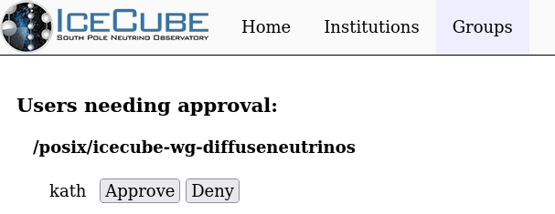
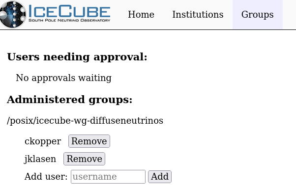

---
hide:
  - toc
---

# Administering Groups

As a group administrator, you can approve or deny all user requests
to join your groups, or directly make changes for existing users.

## Approving Users

You should get an email whenever a user request needs approval, with
the following link:

[https://user-management.icecube.aq/groups](https://user-management.icecube.aq/groups)

The approval page should look like this when there is a request waiting:

You can either approve or deny the request by clicking on the buttons next
to the request.

## Managing Existing Users

You can directly add and remove existing users on the same page:

Remove a user from your groups with the "Remove" button next to their
username.

Add a new user by entering their username and clicking "Add".
