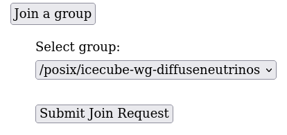

---
hide:
  - toc
---

# Joining a Group

Existing users can join administered groups by editing their profile at
[https://user-management.icecube.aq](https://user-management.icecube.aq).

!!! note

    Only administered groups are shown.  Other groups must be changed by
    IT admins at UW-Madison.  If you have questions about them, email
    [help@icecube.wisc.edu](mailto:help@icecube.wisc.edu).

Here is an example of the profile page group section:

To add a group, select "Join a group".
It should open a selection for the new group:

Select the group you are joining and click submit.

## Upcoming Actions

After submitting the request, it must be approved by the group
administrator.  When they approve the change, you will get an email.
