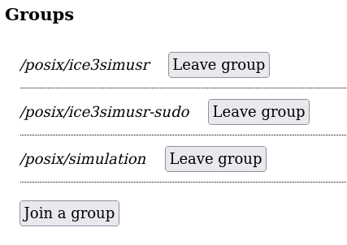

---
hide:
  - toc
---

# Leaving a Group

Existing users can leave administered groups by editing their profile at
[https://user-management.icecube.aq](https://user-management.icecube.aq).

!!! note

    Only administered groups are shown.  Other groups must be changed by
    IT admins at UW-Madison.  If you have questions about them, email
    [help@icecube.wisc.edu](mailto:help@icecube.wisc.edu).

Here is an example of the profile page group section:

To leave a group, select "Leave group".

This action is processed immediately, and the profile page should be
automatically refreshed to not show that group.
