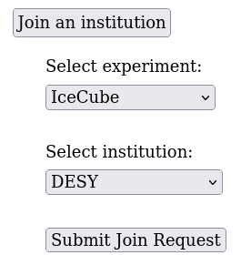

---
hide:
  - toc
---

# Joining an Institution

Existing users can join a secondary institution by editing their profile at
[https://user-management.icecube.aq](https://user-management.icecube.aq).

Here is an example of the profile page:

To add a secondary institution, select "Join an institution".
It should open a selection for the new institution:

Select the instutiton you are joining and click submit.

## Upcoming Actions

After submitting the request, it must be approved by the institution
leader, or designated alternate.  When they approve the
change, you will get an email.
