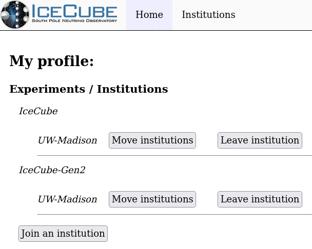
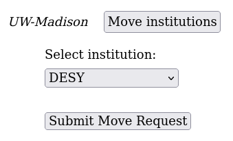

---
hide:
  - toc
---

# Changing Institutions

Existing users moving to a new institution can update that information at
[https://user-management.icecube.aq](https://user-management.icecube.aq).

Here is an example of the profile page:

To exchange an institution for a new one, select "Move institutions".
It should open a selection for the new institution:

Select the instutiton you are moving to and click submit.

## Upcoming Actions

After submitting the request, it must be approved by the institution
leader you are moving to, or designated alternate.  When they approve the
change, you will get an email.
