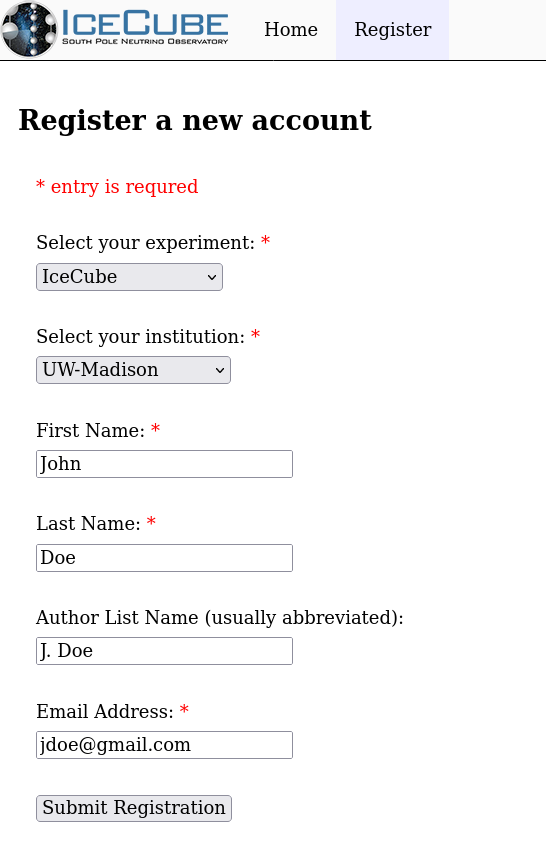

---
hide:
  - toc
---

# New User Registration

New users should register through
[https://user-management.icecube.aq/register](https://user-management.icecube.aq/register).

Here is an example of the registration page:

Most fields are explanatory.  The Author List Name should be filled in
if you should appear on the author list, but can be ignored.
The email address should be an external email account (maybe your local
institution account) that can receive password resets and other
account-oriented emails.

## Upcoming Actions

After submitting the registration, it must be approved by the institution
leader, or designated alternate.  When they approve (or reject) the
registration, you will get an email.

If approved, the email will include basic welcome information,
as well as an initial password that **must be changed** on first login.
