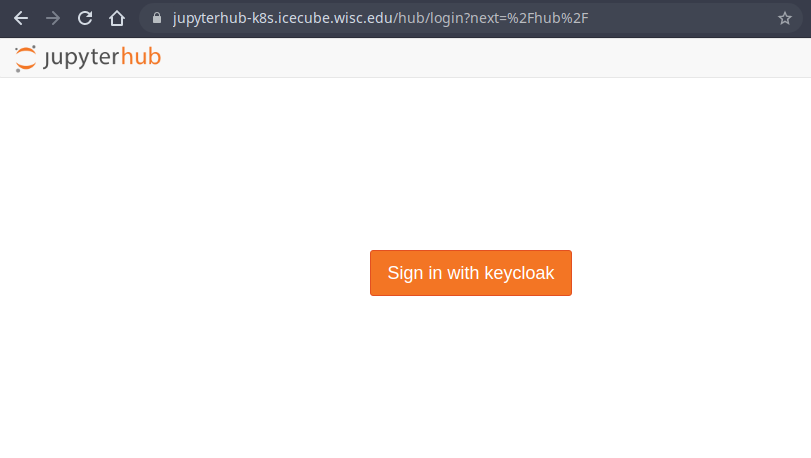
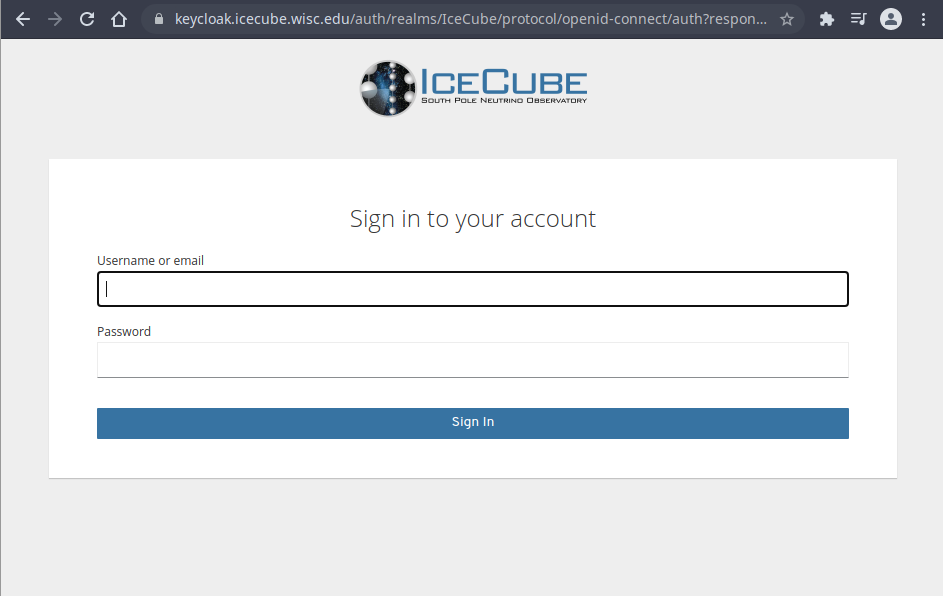

---
hide:
  - toc
---

# User Login

All user login through KeyCloak happens in redirects, so don't be surprised if you click on "login" and get redirected to a different website.

You should experience something like 

From there, you should be redirected to page with a URL like _https://keycloak.icecube.wisc.edu/auth/realms/IceCube/_, where you are prompted to input your username and password

After signing in, you should be redirect back to the page you were on, fully authenticated.
