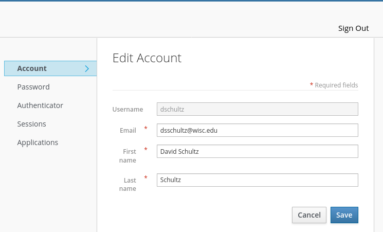
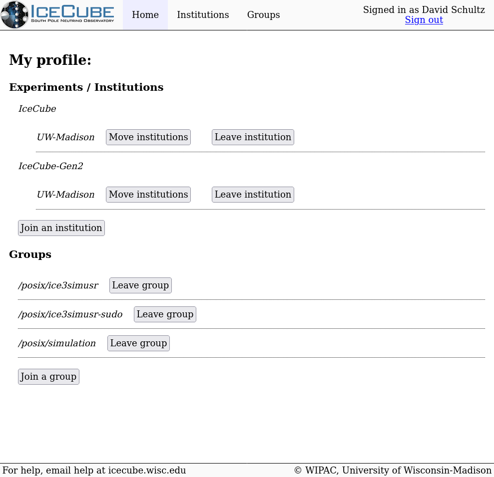

---
hide:
  - toc
---

# User Profile

Basic information about a user, such as their name and external email address,
can be edited by going to your
[Keycloak Account](https://keycloak.icecube.wisc.edu/auth/realms/IceCube/account/).

---

For institution and group information, go to the
[User Management](user-management.icecube.aq/) web application.

